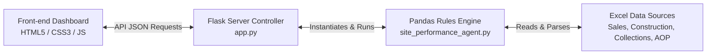
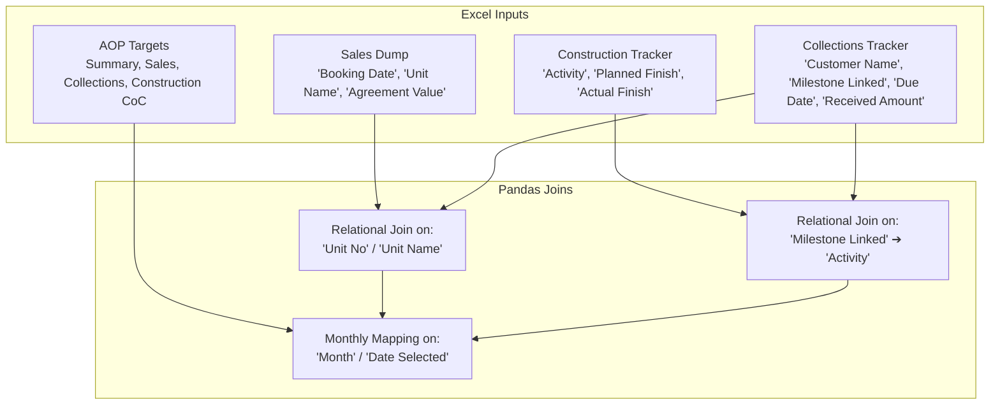

# System Architecture & Relational Dataflows

This document details the software architecture, relational linking pipeline, business rules engine, and data quality safeguards implemented in the **Real Estate Month-End Site Performance Review Portal**.

---

## 1. High-Level System Architecture

The application is structured as a modular, lightweight Python-based micro-service with an interactive, responsive front-end dashboard:



### Component Details
1. **Frontend Dashboard (`static/`, `templates/`)**: Built with responsive vanilla CSS and interactive JS (Chart.js and html2pdf.js). Features reporting period selectors, search queries, priority/severity toggles, and live-streaming workflow integrated monitor simulations.
2. **Flask Controller (`app.py`)**: Routes endpoints (`/api/run` and `/api/download`) and dynamically configures file paths between local development (`static/`) and production environments (serverless `/tmp` directory on Vercel).
3. **Pandas Rules Engine (`site_performance_agent.py`)**: Reads the source spreadsheets, cleans headers, sanitizes Excel date formats, links relational fields, and executes the central business rules matrix.

---

## 2. Relational Linking Pipeline & Data Flow

The core capability of the engine is dynamically linking **four separate Excel spreadsheets** containing transaction dumps and targets to evaluate cross-functional anomalies:



### Relational Mapping Keys:
- **Unit Linkage**: Maps collections payments to sales agreements using matching unit IDs (e.g. `Unit Name` in Sales and `Unit No` in Collections).
- **Milestone Linkage**: Maps customer billing due dates to physical site progress by linking the collection trigger `Milestone Linked` with the construction tracker's `Activity` name.
- **Reporting Period Linkage**: Ingested records are filtered on-the-fly against the selected month (e.g. `2026-06` for June 2026) to calculate specific monthly targets, actuals, and variances.

---

## 3. Business Rules Engine Specification

The engine evaluates data using a deterministic rules matrix to flag risks and assign operational action plans:

### Rules Matrix:

| Risk Category | Check Condition | Severity | Suggested Action Owner |
| :--- | :--- | :--- | :--- |
| **Sales Performance** | Monthly Actual Booking Value < 80% AOP Target | 🔴 RED (Critical) | **Sales Head** |
| **Collections Performance** | Monthly Actual Collections < 85% AOP Target | 🔴 RED (Critical) | **Collections Head** |
| **Construction Delays** | Scheduled task delayed > 15 days from target date | 🟡 AMBER (High) | **Project Head** |
| **CoC Cost Overrun** | Construction cost > 10% above planned CoC | 🔴 RED (Critical) | **Project Head / Finance** |
| **Cash Flow Deficit** | Total Outflows > Total Inflows (Negative NCF) | 🔴 RED (Critical) | **Finance Head** |
| **Cash Flow Leakage** | Construction Milestone 100% complete, but Collection status is 'Unpaid' or billing notices unissued | 🟡 AMBER (High) | **Billing / Collections Team** |

---

## 4. Data Quality Guardrails & Anomaly Logging

Raw real-estate datasets often contain missing, misformatted, or corrupted records. The engine runs a dedicated **sanitization cycle** on startup to catch these and ensure the application never crashes:

```
[Raw Ingestion] ➔ [Missing Value Check] ➔ [Anomalous Date parsing] ➔ [Fallback Fallback Assign] ➔ [Integrity Log Write]
```

1. **Excel Numeric Dates**: Parses float dates (e.g. `45678`) into datetime formats using the `1899-12-30` origin.
2. **Missing Strings**: Maps empty customer names or unassigned unit fields to `"Unassigned"` or `"General Outflow"` instead of dropping them, preserving financial totals.
3. **Cross-file Mismatches**: Logs customer records present in the Collections tracker but missing from the central Sales Dump (identifying invoicing gaps).
4. **Data Quality Audit Log**: Every warning, parsing fallback, or mismatch is recorded with a timestamp and shown directly in the **Data Quality** tab of the dashboard for audit reviews.

---

## 5. Output Distribution & Human Review Points

- **Excel Report Compilation**: Saves the results into a multi-tab formatted spreadsheet (`Site_Performance_Report.xlsx`) with custom styling, borders, and column spacing.
- **Comprehensive PDF Reports**: Generates structured, landscape PDF audits for board reviews.
- **Microsoft Teams Communications**: Compiles actionable, copy-ready markdown notification templates for cross-departmental warnings.
- **Operational Review**: Action plans and escalations are grouped by departments and prioritized, allowing team heads to filter and assign tasks instantly.
