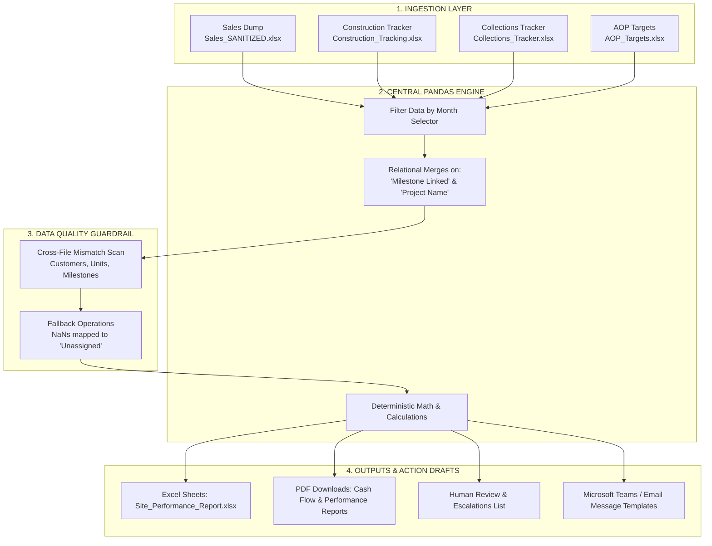

# Month-End Site Performance Review Portal
An automated rules engine, cross-functional risk analysis dashboard, and relational database linker designed for real-estate project managers and senior management.

> [!IMPORTANT]
> 🚀 **LIVE DEPLOYMENT PORTAL**: **[https://real-estate-portal-gamma-orcin.vercel.app](https://real-estate-portal-gamma-orcin.vercel.app)**

---

## 🛠️ Process Note (Setup & Delivery)

### 1. Setup Steps & How to Run
To run the application locally on your machine, follow these steps:

1. **Clone the Repository**:
   ```bash
   git clone https://github.com/Rishikesh073/Real-estate.git
   cd Real-estate
   ```

2. **Install Dependencies**:
   Ensure you have Python 3.8+ installed. Install the required libraries using pip:
   ```bash
   pip install -r requirements.txt
   ```

3. **Start the Flask Web App**:
   Run the application server:
   ```bash
   python app.py
   ```

4. **Access the Dashboard**:
   Open your browser and navigate to:
   👉 **[http://127.0.0.1:5000](http://127.0.0.1:5000)**

---

### 2. Tools & Stack Used
- **Core Engine (Backend)**: Python, Pandas (Relational merges, groupings, rules validations), NumPy.
- **Web Interface (Frontend)**: HTML5, CSS3 (Premium dark theme, custom responsive grid, glassmorphism card panels), Vanilla JavaScript (DOM manipulation, event filtering listeners).
- **Visualization & Libraries**: 
  - **Chart.js**: Render NCF bar chart.
  - **FontAwesome (v6.4.0)**: Premium icons.
  - **html2pdf.js**: Client-side landscape PDF reports generator.

---

### 3. Business Assumptions, Limitations & Dependencies
- **Excel Serial Dates**: Raw date columns in the sales and construction sheets are read as numeric floats (Excel days count since 1899-12-30). The engine auto-converts these dynamically to datetime formats.
- **Crores to Rupees Scaling**: Planned targets in `Summary Targets` and details targets are ingested in Crores. The engine dynamically scales them to Rupees (multiplies by $10^7$) to evaluate them against raw transaction values.
- **Milestone Relational Mapping**: We assume `Milestone Linked` in collections relates to `Activity` in construction to evaluate construction completions against billing triggers.
- **Static Construction Snapshot**: The construction daily target file acts as the snapshot for June 2026. Therefore, filtering April/May construction actuals will evaluate to zero (as physical construction on tower R5B had not yet started).

---

## 🖥️ Architecture Note (1-Slide Summary)

Below is a structured "Slide" visualizing the system dataflow and relational linkage architecture:



### 📋 Calculations & Dataflow Processing Details

| Stage | Action & Calculations | Human Review / Escalation Point |
| :--- | :--- | :--- |
| **Ingestion** | Parses the 4 Excel files, handles skipped headers, and maps numeric Excel serial numbers into standard datetime columns. | **Data Quality Logs**: Spot missing file reads, date formatting anomalies, or parsing alerts. |
| **Relational Linkage** | Joins collections milestones to construction activities to identify if invoicing has occurred on incomplete site structures. | **Cash Flow Leakage**: Triggers if a milestone is 100% complete physically but collection status remains "Unpaid". |
| **Rules Engine** | Checks: (1) Monthly Booking Value < 80% AOP; (2) Collections < 85% Target; (3) Milestone delay > 15 days; (4) CoC costs overrun > 10%. | **Escalations list**: Highlighted RED/AMBER flags based on severity, filtered by due date and owner. |
| **Action Outputs** | Generates owner-wise action plans (Sales Head, Project Head, Collections Head) and compiles communications templates. | **Draft templates**: Managers review auto-written MS Teams messages before distribution. |
